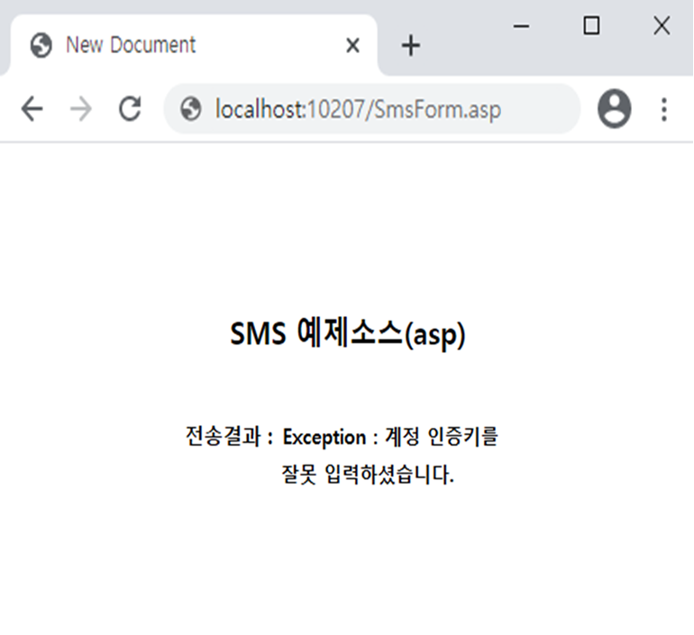

# ASP를 이용한 예제



## ASP를 이용한 SMS 웹 서비스 이용방법 <a id="asp-net-vb-sms"></a>

### 1. SMS발송 정보를 입력 받을 폼을 작성합니다. \(예제소스에 포함\) <a id="1-visual-studio-net"></a>

> 계정 인증키는 \[계정관리 &gt; 호스팅 계정정보\]에서 확인 하실 수 있습니다.​


### 2. 편집기를 이용해 아래의 소스코드를 작성하여 SendSms.asp로 저장합니다. <a id="2"></a>

> 하단의 예제는 MSXML 6.0을 사용합니다.                                                   [MSXML 6.0 다운로드](https://www.microsoft.com/ko-kr/download/search.aspx?q=MSXML)

```markup
<%
'받는사람 핸드폰 번호
sTranPhone = Request("txtTranPhone")

'보내는사람 핸드폰 번호
sTranCallback = Request("txtTranCallback")

'예약전송 일시(생략시 즉시전송)
sTranDate = Request("txtTranDate")

'전송 메시지
sTranMsg = Request("txtTranMsg")

'계정번호
sGuestNo = Request("txtGuestNo")

'계정 인증키
sGuestAuthKey = Request("txtGuestAuthKey")

'발송구분 (SMS/LMS/MMS)
sType = Request("comType")

'LMS/MMS일 경우 제목
sSubject = Request("txtSubject")

 '*======================================================================*\
 ' MMS일 경우 첨부파일 처리
 ' 서버&로컬 에 저장된 이미지 파일 읽어올때.
 ' 웹경로,로컬경로 모두 가능 합니다.
'\*======================================================================*/

'웹경로
'imgPath = "http://websvc.nesolution.com/sms/MMSAttachFiles/M050085/20180510145947.jpg"
'로컬경로
imgPath ="d:\img\test.jpg"

 '"," 콤마로 구분 최대 3개 첨부 가능 합니다.
stringBase64files = GetStringBase64files(imgPath)&_
   ","&GetStringBase64files(imgPath)&","&GetStringBase64files(imgPath)


Function GetStringBase64files(imgPath)
    imgPath = LCase(imgPath)

    if LEFT(imgPath,4) ="http" THEN
         Set Http= CreateObject("MSXML2.ServerXMLHTTP")
          Http.Open "GET", imgPath, false
          Http.Send()
          binData = Http.ResponseBody
          GetStringBase64files = Base64encode(binData)
        Set Http = Nothing
    ELSE
          Dim inputStream
          Set inputStream = CreateObject("ADODB.Stream")
          inputStream.Open
          inputStream.Type = 1  ' adTypeBinary
          inputStream.LoadFromFile imgPath
          Dim bytes: bytes = inputStream.Read
         GetStringBase64files =Base64Encode(bytes)
    END IF
End Function

Function Base64Encode(sText)
    Dim oXML, oNode
    Set oXML = CreateObject("Msxml2.DOMDocument.3.0")
    Set oNode = oXML.CreateElement("base64")
    oNode.dataType = "bin.base64"
    oNode.nodeTypedValue = sText
    Base64Encode = oNode.text
    Set oNode = Nothing
    Set oXML = Nothing
End Function

'*======================================================================*\
' MMS일 경우 첨부파일 처리
 '프론트에서 이미지 파일을 base64로 생성후 post로 받아 올때.
'\*======================================================================*/
'첨부파일
'stringBase64files = Request("Base64files")
'stringBase64files = Replace(stringBase64files,"\t","+")


sParam = "cmd=SendSms"
sParam = sParam + "&guest_no=" + sGuestNo
sParam = sParam + "&guest_key=" + sGuestAuthKey
sParam = sParam + "&tran_phone=" + sTranPhone
sParam = sParam + "&tran_callback=" + sTranCallback
sParam = sParam + "&tran_date=" + sTranDate
sParam = sParam + "&tran_msg=" + Server.URLEncode(sTranMsg)
sParam = sParam + "&type=" + sType

If sType = "LMS" Or sType = "MMS" Then
    sParam = sParam + "&subject=" + Server.URLEncode(sSubject)	'제목
End IF

If sType = "MMS" Then
    sParam = sParam + "&files=" + Server.URLEncode(stringBase64files)	'파일
End IF

sResponse = SendPOST("http://websvc.nesolution.com/SMS/SMS.aspx", sParam)

function SendPOST(parm_url, parm_post)
    Set xmlHttp = Server.Createobject("MSXML2.ServerXMLHTTP.6.0")
    xmlHttp.Open "POST", parm_url, False
    xmlHttp.setRequestHeader "User-Agent", "asp httprequest"
    xmlHttp.setRequestHeader "content-type", "application/x-www-form-urlencoded"
    xmlHttp.Send parm_post
    SendPOST = xmlHttp.responseText
    xmlHttp.abort()
    set xmlHttp = Nothing
end function

%>

<HTML>
<HEAD>
    <TITLE>New Document</TITLE>
    <meta http-equiv="Content-Type" content="text/html; charset=ks_c_5601-1987">
    <style type="text/css">
    <!--
      .unnamed1 { font-family:"굴림"; font-size:9pt; line-height:12pt}
    //-->
    </style>
</HEAD>
<BODY>
    <div align="center">
      <h2>SMS 예제소스(asp)</h2>
      <br>
      <span class="unnamed1">전송결과 : <b><%=sResponse%></b></span>
    </div>
</BODY>
</HTML>
```

> ### **파라미터** ✔ <a id="undefined"></a>

<table>
  <thead>
    <tr>
      <th style="text-align:left"><b>&#xD30C;&#xB77C;&#xBBF8;&#xD130;</b>
      </th>
      <th style="text-align:left"><b>&#xC124;&#xBA85;</b>
      </th>
    </tr>
  </thead>
  <tbody>
    <tr>
      <td style="text-align:left">stran_phone</td>
      <td style="text-align:left">
        <p>&#xC218;&#xC2E0;&#xC790; &#xC804;&#xD654;&#xBC88;&#xD638;(&#xC0DD;&#xB7B5;&#xBD88;&#xAC00;),
          &#xC5EC;&#xB7EC;&#xBC88;&#xD638;&#xC77C; &#xACBD;&#xC6B0;&#xC5D0;&#xB294;
          ;&#xC73C;&#xB85C; &#xAD6C;&#xBD84;.</p>
        <p>&#xC804;&#xD654;&#xBC88;&#xD638; &#xAD6C;&#xBD84;&#xC790; &#xB300;&#xC26C;(-)&#xB294;
          &#xC788;&#xAC70;&#xB098; &#xC5C6;&#xAC70;&#xB098; &#xC0C1;&#xAD00;&#xC5C6;&#xC74C;</p>
      </td>
    </tr>
    <tr>
      <td style="text-align:left">stran_callback</td>
      <td style="text-align:left">&#xC1A1;&#xC2E0;&#xC790; &#xC804;&#xD654;&#xBC88;&#xD638;(&#xC0DD;&#xB7B5;&#xBD88;&#xAC00;)</td>
    </tr>
    <tr>
      <td style="text-align:left">stran_date</td>
      <td style="text-align:left">
        <p>&#xC608;&#xC57D; &#xC804;&#xC1A1;&#xC2DC;&#xC5D0;&#xB9CC; &#xC0AC;&#xC6A9;,
          &#xD3EC;&#xB9F7;&#xC740; &#xC2DC;&#xBD84;&#xAE4C;&#xC9C0; &#xD3EC;&#xD568;&#xB41C;
          &#xB0A0;&#xC9DC; &#xD3EC;&#xB9F7;.</p>
        <p>&#xC0DD;&#xB7B5;&#xC2DC;&#xC5D0;&#xB294; &#xC989;&#xC2DC; &#xC804;&#xC1A1;(&#xC608;.2003-01-01
          13:01)</p>
      </td>
    </tr>
    <tr>
      <td style="text-align:left">stran_msg</td>
      <td style="text-align:left">
        <p>&#xC804;&#xC1A1; &#xBA54;&#xC2DC;&#xC9C0;(&#xC0DD;&#xB7B5;&#xBD88;&#xAC00;).</p>
        <p>SMS : &#xCD5C;&#xB300; 80byte (&#xC6A9;&#xB7C9;&#xC774; &#xB118;&#xC73C;&#xBA74;
          &#xC9E4;&#xB824;&#xC11C; &#xC804;&#xC1A1;)</p>
        <p>LMS/MMS : &#xCD5C;&#xB300; 2,000byte</p>
      </td>
    </tr>
    <tr>
      <td style="text-align:left">guest_no</td>
      <td style="text-align:left">&#xACC4;&#xC815;&#xBC88;&#xD638;(&#xC608;.000001)</td>
    </tr>
    <tr>
      <td style="text-align:left">guest_key</td>
      <td style="text-align:left">
        <p>&#xAD00;&#xB9AC;&#xC790; &#xACC4;&#xC815;&#xACFC; &#xC554;&#xD638;&#xB97C;
          &#xC774;&#xC6A9;&#xD574; &#xC0DD;&#xC131;&#xD55C; &#xACC4;&#xC815; &#xC778;&#xC99D;
          &#xD0A4;</p>
        <p>(&#xD68C;&#xC6D0;&#xC804;&#xC6A9; &#xC0AC;&#xC774;&#xD2B8;&#xC5D0;&#xC11C;
          &#xD655;&#xC778; &#xAC00;&#xB2A5;)</p>
      </td>
    </tr>
    <tr>
      <td style="text-align:left">type</td>
      <td style="text-align:left">
        <p>&#xBA54;&#xC2DC;&#xC9C0; &#xC804;&#xC1A1; &#xD0C0;&#xC785;. &quot;SMS&quot;
          / &quot;LMS&quot; / &quot;MMS&quot; / &quot;AUTO&quot; &#xC911;&#xC5D0;&#xC11C;
          &#xC120;&#xD0DD;.</p>
        <p>LMS/MMS &#xC0AC;&#xC6A9; &#xC2DC; &#xC11C;&#xBE44;&#xC2A4; &#xC2E0;&#xCCAD;&#xC774;
          &#xB418;&#xC5B4; &#xC788;&#xC5B4;&#xC57C; &#xD568;</p>
        <p>&#xBE48; &#xAC12;&#xC744; &#xB118;&#xAE30;&#xBA74; &quot;SMS&quot;&#xD615;&#xC2DD;&#xC73C;&#xB85C;
          &#xBC1C;&#xC1A1;</p>
        <p>&quot;AUTO&quot;&#xB294; &#xBA54;&#xC2DC;&#xC9C0;&#xC758; &#xAE38;&#xC774;&#xB97C;
          &#xCCB4;&#xD06C;&#xD558;&#xC5EC; 80byte&#xB97C; &#xCD08;&#xACFC; &#xC2DC;
          &#xC790;&#xB3D9;&#xC73C;&#xB85C; LMS&#xB85C; &#xBC1C;&#xC1A1;</p>
      </td>
    </tr>
    <tr>
      <td style="text-align:left">subject</td>
      <td style="text-align:left">
        <p>LMS/MMS &#xBA54;&#xC2DC;&#xC9C0;&#xC758; &#xBA54;&#xC2DC;&#xC9C0; &#xC81C;&#xBAA9;.</p>
        <p>LMS/MMS &#xBC29;&#xC2DD;&#xC744; &#xC0AC;&#xC6A9;&#xD558;&#xB294; &#xACBD;&#xC6B0;
          &#xD544;&#xC218;.</p>
      </td>
    </tr>
    <tr>
      <td style="text-align:left">files</td>
      <td style="text-align:left">
        <p>MMS &#xCCA8;&#xBD80; &#xC774;&#xBBF8;&#xC9C0; &#xD30C;&#xC77C;&#xBA85;.</p>
        <p>&#xCCA8;&#xBD80; &#xD30C;&#xC77C;&#xC774; 2&#xAC1C; &#xC774;&#xC0C1;&#xC778;
          &#xACBD;&#xC6B0; &#xCEF4;&#xB9C8;(,)&#xB85C; &#xAD6C;&#xBD84;</p>
        <p>MMS&#xC758; &#xACBD;&#xC6B0; &#xD544;&#xC218;</p>
        <p>&#xCD5C;&#xB300; 3&#xAC1C; &#xAE4C;&#xC9C0; &#xC9C0;&#xC815; &#xAC00;&#xB2A5;,
          &#xCD5C;&#xB300; 50kb gif,png,jpg &#xD30C;&#xC77C;&#xD615;&#xC2DD;</p>
      </td>
    </tr>
  </tbody>
</table>

> ### **반환 값** ✔ <a id="undefined-1"></a>


#### 성공 시    "OK"



**실패 시   "Exception: 에러메시지"**


## 6. 실행결과 화면입니다. <a id="6"></a>

> 정상적으로 메시지가 발송되었을 경우


> 오류로 인하여 메시지를 발송하지 못했을 경우



