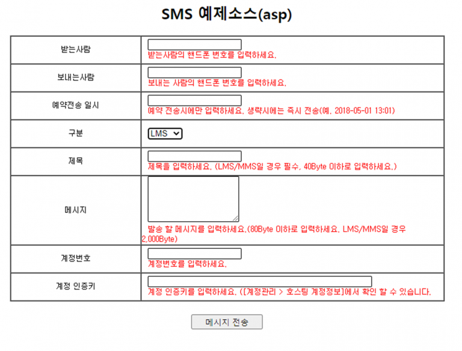

# ASP를 이용한 예제



## ASP를 이용한 SMS 웹 서비스 이용방법 <a id="asp-net-vb-sms"></a>

### 1. SMS발송 정보를 입력 받을 폼을 작성합니다. \(예제소스에 포함\) <a id="1-visual-studio-net"></a>

> 계정 인증키는 \[계정관리 &gt; 호스팅 계정정보\]에서 확인 하실 수 있습니다.​



### 2. 편집기를 이용해 아래의 소스코드를 작성하여 SendSms.asp로 저장합니다. <a id="2"></a>

> 하단의 예제는 MSXML 6.0을 사용합니다.                                                   [MSXML 6.0 다운로드](https://www.microsoft.com/ko-kr/download/search.aspx?q=MSXML)


### 3. 아래 DpSms 웹 서비스URL을 입력하고 웹 참조 이름을 결정한 후 참조 추가 버튼을 누릅니다. <a id="3-dpsms-url"></a>


### 4. 아래와 같이 SMS발송 정보를 입력 받을 폼을 작성합니다. \(예제소스에 포함\) <a id="4-sms"></a>


### 5. 메시지 전송 버튼을 더블 클릭하여 btnSend\_Click 이벤트에 아래의 소스 코드를 삽입합니다. <a id="5-btnsend_click"></a>

```text
Private Sub btnSend_Click(ByVal sender As System.Object, ByVal e As System.EventArgs) Handles btnSend.Click    'DpSms 웹 서비스 개체 생성    Dim oSms As WebSvc_Sms.SMS    oSms = New WebSvc_Sms.SMS​    ' 메시지 발송   메서드 호출    ' txtTranPhone          받는사람    ' txtTranCallback      보내는사람    ' txtTranDate            예약전송 일시    ' txtTranMsg            메시지    ' txtGuestNo            계정번호    ' txtGuestAuthKey    계정 인증키    ' stringBase64files   첨부파일 콤마로 구분 최대3개​     Dim stringBase64files As String = String.Empty     If Request.Files IsNot Nothing Then         For i As Integer = 0 To Request.Files.Count - 1            Dim file As HttpPostedFile = Request.Files(i)            stringBase64files &= ParseCv(file) & ","         Next i     End If​    Dim sResult As String    sResult = oSms.SendSms(txtTranPhone.Text, _                                        txtTranCallback.Text, _                                        txtTranDate.Text, _                                        txtTranMsg.Text, _                                        txtGuestNo.Text, _                                        txtGuestAuthKey.Text, _      comType.SelectedValue, txtSubject.Text, stringBase64files)​    lblResult.Text = sResultEnd Sub​Private Function ParseCv(ByVal fileBase As HttpPostedFile) As String​  Dim fileInBytes(fileBase.ContentLength - 1) As Byte  Using theReader As New BinaryReader(fileBase.InputStream)       fileInBytes = theReader.ReadBytes(fileBase.ContentLength)  End Using  Dim fileAsString As String = Convert.ToBase64String(fileInBytes)     Return fileAsStringEnd Function
```

> ### **파라미터** ✔ <a id="undefined"></a>
>
> ### **반환 값** ✔ <a id="undefined-1"></a>

## 6. 실행결과 화면입니다. <a id="6"></a>

> 정상적으로 메시지가 발송되었을 경우


> 오류로 인하여 메시지를 발송하지 못했을 경우


