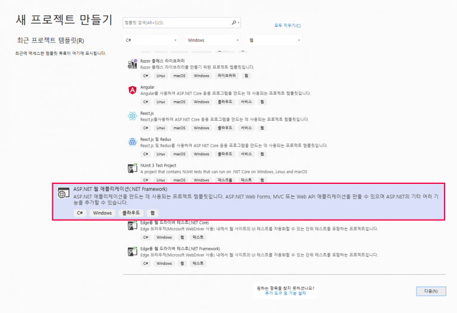
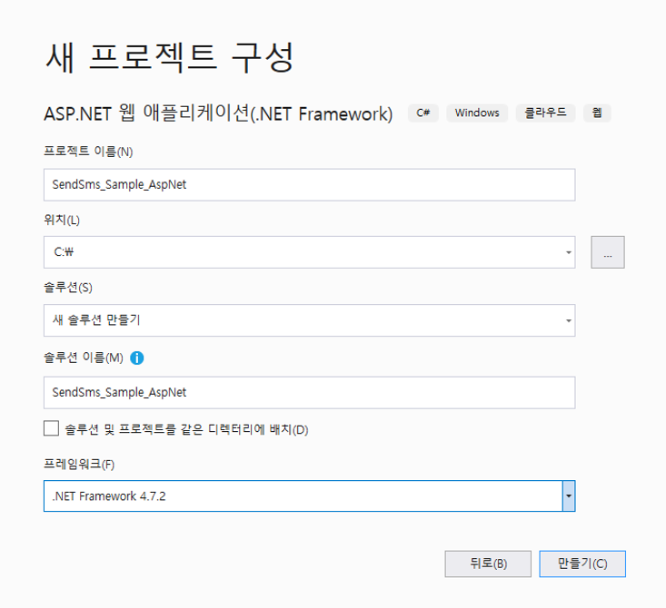
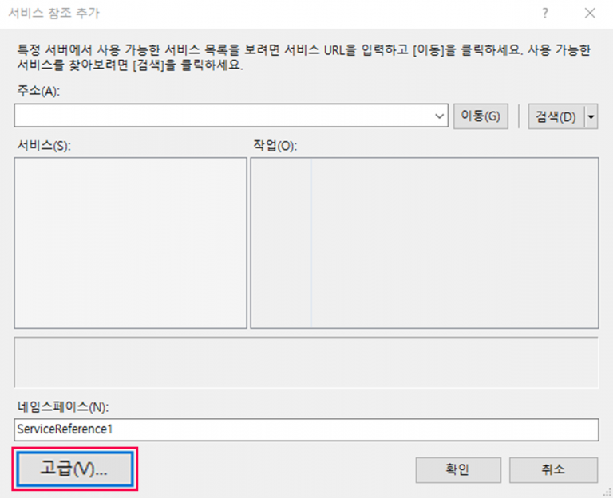
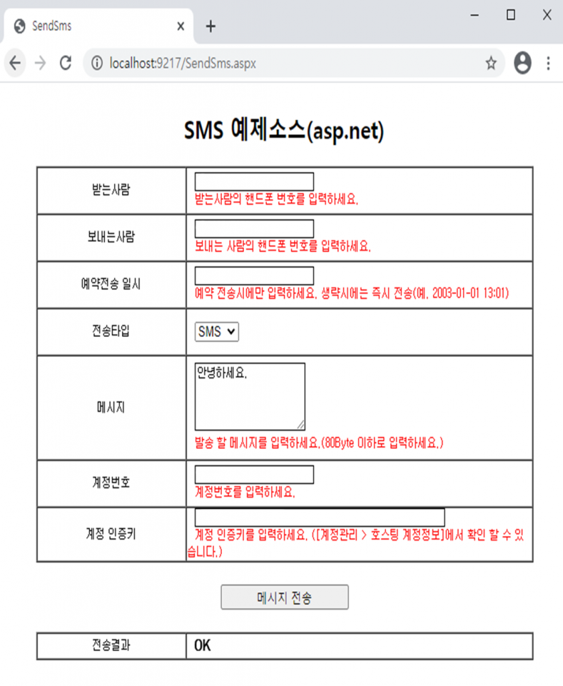

# ASP.NET\(C\#\)을 이용한 예제

## ASP.NET\(C\#\)를 이용한 SMS 웹 서비스 이용방법



### 1. Visual Studio.NET을 열어 새로운 프로젝트를 생성합니다.





### 2. 솔루션 탐색기에서 마우스 오른쪽을 클릭하여 웹 참조 메뉴를 선택합니다.


### 3. 아래 DpSms 웹 서비스URL을 입력하고 웹 참조 이름을 결정한 후 참조 추가 버튼을 누릅니다.

> SMS 웹 참조 URL : [http://websvc.nesolution.com/sms/sms.asmx](http://websvc.nesolution.com/sms/sms.asmx)




### 4. 아래와 같이 SMS발송 정보를 입력 받을 폼을 작성합니다. \(예제소스에 포함\)


### 5. 메시지 전송 버튼을 더블 클릭하여 btnSend\_Click 이벤트에 아래의 소스 코드를 삽입합니다.

```csharp
private void btnSend_Click(object sender, System.EventArgs e)
{
    //Sms 웹 서비스 개체 생성
    WebSvc_Sms.SMS oSms = new WebSvc_Sms.SMS();

    //첨부파일 처리
    string stringBase64files =  string.Empty;
    if (Request.Files != null)
    {
        for (int i = 0; i < Request.Files.Count; i++)
        {
            HttpPostedFile file = Request.Files[i];
            stringBase64files += ParseCv(file) + ",";    //콤마(',')로 구분 합니다.
        }
    }

    //메시지 발송 메서드 호출
    string sResult = oSms.SendSms(txtTranPhone.Text,         //받는사람
            txtTranCallback.Text,         //보내는사람
            txtTranDate.Text,              //예약전송 일시
            txtTranMsg.Text,               //메시지
            txtGuestNo.Text,                //계정번호
            txtGuestAuthKey.Text,      //계정 인증키
            comType.SelectedValue,    //전송타입(SMS,LMS,MMS)
            txtSubject,                  // 메시지 제목(LMS/MMS)
            stringBase64files);   // (MMS)첨부파일 '콤마(",")로 구분' 최대3개
    //전송결과
    lblResult.Text = sResult;
}

 /// 첨부파일 Base64String 형식으로 변환 후 string 형식으로 리턴
private  string ParseCv(HttpPostedFile fileBase)
{
    byte[] fileInBytes = new byte[fileBase.ContentLength];
    using (BinaryReader theReader = new BinaryReader(fileBase.InputStream))
    {
        fileInBytes = theReader.ReadBytes(fileBase.ContentLength);
    }
    string fileAsString = Convert.ToBase64String(fileInBytes);

    return fileAsString;
}
```

> ### **파라미터** ✅

<table>
  <thead>
    <tr>
      <th style="text-align:center"><b>&#xD30C;&#xB77C;&#xBBF8;&#xD130; </b>
      </th>
      <th style="text-align:left"><b>&#xC124;&#xBA85; </b>
      </th>
    </tr>
  </thead>
  <tbody>
    <tr>
      <td style="text-align:center">stran_phone</td>
      <td style="text-align:left">
        <p>&#xC218;&#xC2E0;&#xC790; &#xC804;&#xD654;&#xBC88;&#xD638;(&#xC0DD;&#xB7B5;&#xBD88;&#xAC00;),
          &#xC5EC;&#xB7EC;&#xBC88;&#xD638;&#xC77C; &#xACBD;&#xC6B0;&#xC5D0;&#xB294;
          ;&#xC73C;&#xB85C; &#xAD6C;&#xBD84;.</p>
        <p>&#xC804;&#xD654;&#xBC88;&#xD638; &#xAD6C;&#xBD84;&#xC790; &#xB300;&#xC26C;(-)&#xB294;
          &#xC788;&#xAC70;&#xB098; &#xC5C6;&#xAC70;&#xB098; &#xC0C1;&#xAD00;&#xC5C6;&#xC74C;</p>
      </td>
    </tr>
    <tr>
      <td style="text-align:center">stran_callback</td>
      <td style="text-align:left">&#xC1A1;&#xC2E0;&#xC790; &#xC804;&#xD654;&#xBC88;&#xD638;(&#xC0DD;&#xB7B5;&#xBD88;&#xAC00;)</td>
    </tr>
    <tr>
      <td style="text-align:center">stran_date</td>
      <td style="text-align:left">
        <p>&#xC608;&#xC57D; &#xC804;&#xC1A1;&#xC2DC;&#xC5D0;&#xB9CC; &#xC0AC;&#xC6A9;,
          &#xD3EC;&#xB9F7;&#xC740; &#xC2DC;&#xBD84;&#xAE4C;&#xC9C0; &#xD3EC;&#xD568;&#xB41C;
          &#xB0A0;&#xC9DC; &#xD3EC;&#xB9F7;.</p>
        <p>&#xC0DD;&#xB7B5;&#xC2DC;&#xC5D0;&#xB294; &#xC989;&#xC2DC; &#xC804;&#xC1A1;(&#xC608;.2003-01-01
          13:01)</p>
      </td>
    </tr>
    <tr>
      <td style="text-align:center">stran_msg</td>
      <td style="text-align:left">
        <p>&#xC804;&#xC1A1; &#xBA54;&#xC2DC;&#xC9C0;(&#xC0DD;&#xB7B5;&#xBD88;&#xAC00;).</p>
        <p>SMS : &#xCD5C;&#xB300; 80byte (&#xC6A9;&#xB7C9;&#xC774; &#xB118;&#xC73C;&#xBA74;
          &#xC9E4;&#xB824;&#xC11C; &#xC804;&#xC1A1;)</p>
        <p>LMS/MMS : &#xCD5C;&#xB300; 2,000byte</p>
      </td>
    </tr>
    <tr>
      <td style="text-align:center">guest_no</td>
      <td style="text-align:left">&#xACC4;&#xC815;&#xBC88;&#xD638;(&#xC608;.000001)</td>
    </tr>
    <tr>
      <td style="text-align:center">guest_key</td>
      <td style="text-align:left">
        <p>&#xAD00;&#xB9AC;&#xC790; &#xACC4;&#xC815;&#xACFC; &#xC554;&#xD638;&#xB97C;
          &#xC774;&#xC6A9;&#xD574; &#xC0DD;&#xC131;&#xD55C; &#xACC4;&#xC815; &#xC778;&#xC99D;
          &#xD0A4;</p>
        <p>(&#xD68C;&#xC6D0;&#xC804;&#xC6A9; &#xC0AC;&#xC774;&#xD2B8;&#xC5D0;&#xC11C;
          &#xD655;&#xC778; &#xAC00;&#xB2A5;)</p>
      </td>
    </tr>
    <tr>
      <td style="text-align:center">type</td>
      <td style="text-align:left">
        <p>&#xBA54;&#xC2DC;&#xC9C0; &#xC804;&#xC1A1; &#xD0C0;&#xC785;. &quot;SMS&quot;
          / &quot;LMS&quot; / &quot;MMS&quot; / &quot;AUTO&quot; &#xC911;&#xC5D0;&#xC11C;
          &#xC120;&#xD0DD;.</p>
        <p>LMS/MMS &#xC0AC;&#xC6A9; &#xC2DC; &#xC11C;&#xBE44;&#xC2A4; &#xC2E0;&#xCCAD;&#xC774;
          &#xB418;&#xC5B4; &#xC788;&#xC5B4;&#xC57C; &#xD568;</p>
        <p>&#xBE48; &#xAC12;&#xC744; &#xB118;&#xAE30;&#xBA74; &quot;SMS&quot;&#xD615;&#xC2DD;&#xC73C;&#xB85C;
          &#xBC1C;&#xC1A1;</p>
        <p>&quot;AUTO&quot;&#xB294; &#xBA54;&#xC2DC;&#xC9C0;&#xC758; &#xAE38;&#xC774;&#xB97C;
          &#xCCB4;&#xD06C;&#xD558;&#xC5EC; 80byte&#xB97C; &#xCD08;&#xACFC; &#xC2DC;
          &#xC790;&#xB3D9;&#xC73C;&#xB85C; LMS&#xB85C; &#xBC1C;&#xC1A1;</p>
      </td>
    </tr>
    <tr>
      <td style="text-align:center">subject</td>
      <td style="text-align:left">
        <p>LMS/MMS &#xBA54;&#xC2DC;&#xC9C0;&#xC758; &#xBA54;&#xC2DC;&#xC9C0; &#xC81C;&#xBAA9;.</p>
        <p>LMS/MMS &#xBC29;&#xC2DD;&#xC744; &#xC0AC;&#xC6A9;&#xD558;&#xB294; &#xACBD;&#xC6B0;
          &#xD544;&#xC218;.</p>
      </td>
    </tr>
    <tr>
      <td style="text-align:center">files</td>
      <td style="text-align:left">
        <p>MMS &#xCCA8;&#xBD80; &#xC774;&#xBBF8;&#xC9C0; &#xD30C;&#xC77C;&#xBA85;.</p>
        <p>&#xCCA8;&#xBD80; &#xD30C;&#xC77C;&#xC774; 2&#xAC1C; &#xC774;&#xC0C1;&#xC778;
          &#xACBD;&#xC6B0; &#xCEF4;&#xB9C8;(,)&#xB85C; &#xAD6C;&#xBD84;</p>
        <p>MMS&#xC758; &#xACBD;&#xC6B0; &#xD544;&#xC218;</p>
        <p>&#xCD5C;&#xB300; 3&#xAC1C; &#xAE4C;&#xC9C0; &#xC9C0;&#xC815; &#xAC00;&#xB2A5;,
          &#xCD5C;&#xB300; 50kb gif,png,jpg &#xD30C;&#xC77C;&#xD615;&#xC2DD;</p>
      </td>
    </tr>
    <tr>
      <td style="text-align:center">&#xBC18;&#xD658; &#xAC12;</td>
      <td style="text-align:left">&#xC131;&#xACF5; &#xC2DC;(OK), &#xC2E4;&#xD328; &#xC2DC;(&#xC5D0;&#xB7EC;&#xBA54;&#xC2DC;&#xC9C0;)</td>
    </tr>
  </tbody>
</table>

> ### **반환 값** ✅


#### 성공 시    "OK"



**실패 시    "Exception: 에러메시지"**


### 6. 실행결과 화면입니다.




