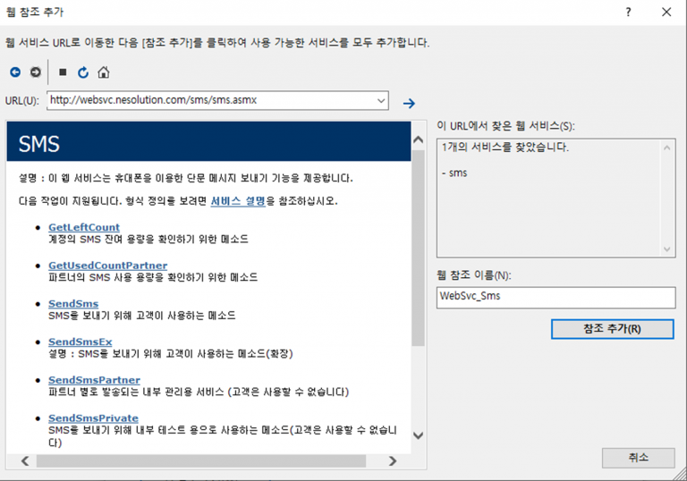

# ASP.NET\(VB\)을 이용한 예제

## ASP.NET\(VB\)를 이용한 SMS 웹 서비스 이용방법



### 1. Visual Studio.NET을 열어 새로운 프로젝트를 생성합니다.


### 2. 솔루션 탐색기에서 마우스 오른쪽을 클릭하여 웹 참조 메뉴를 선택합니다.


### 3. 아래 DpSms 웹 서비스URL을 입력하고 웹 참조 이름을 결정한 후 참조 추가 버튼을 누릅니다.

> DpSms 웹 참조 URL : [http://websvc.nesolution.com/sms/sms.asmx](http://websvc.nesolution.com/sms/sms.asmx)​




### 4. 아래와 같이 SMS발송 정보를 입력 받을 폼을 작성합니다. \(예제소스에 포함\)


### 5. 메시지 전송 버튼을 더블 클릭하여 btnSend\_Click 이벤트에 아래의 소스 코드를 삽입합니다.

```csharp
Private Sub btnSend_Click(ByVal sender As System.Object, ByVal e As System.EventArgs) Handles btnSend.Click
    'DpSms 웹 서비스 개체 생성
    Dim oSms As WebSvc_Sms.SMS
    oSms = New WebSvc_Sms.SMS

    ' 메시지 발송   메서드 호출
    ' txtTranPhone          받는사람
    ' txtTranCallback      보내는사람
    ' txtTranDate            예약전송 일시
    ' txtTranMsg            메시지
    ' txtGuestNo            계정번호
    ' txtGuestAuthKey    계정 인증키
    ' stringBase64files   첨부파일 콤마로 구분 최대3개

     Dim stringBase64files As String = String.Empty
     If Request.Files IsNot Nothing Then
         For i As Integer = 0 To Request.Files.Count - 1
            Dim file As HttpPostedFile = Request.Files(i)
            stringBase64files &= ParseCv(file) & ","
         Next i
     End If

    Dim sResult As String
    sResult = oSms.SendSms(txtTranPhone.Text, _
                                        txtTranCallback.Text, _
                                        txtTranDate.Text, _
                                        txtTranMsg.Text, _
                                        txtGuestNo.Text, _
                                        txtGuestAuthKey.Text, _
      comType.SelectedValue, txtSubject.Text, stringBase64files)

    lblResult.Text = sResult
End Sub

Private Function ParseCv(ByVal fileBase As HttpPostedFile) As String

  Dim fileInBytes(fileBase.ContentLength - 1) As Byte
  Using theReader As New BinaryReader(fileBase.InputStream)
       fileInBytes = theReader.ReadBytes(fileBase.ContentLength)
  End Using
  Dim fileAsString As String = Convert.ToBase64String(fileInBytes)
     Return fileAsString
End Function
```

> ### **파라미터** ✅

> ### **반환 값** ✅

## 6. 실행결과 화면입니다. <a id="6"></a>


