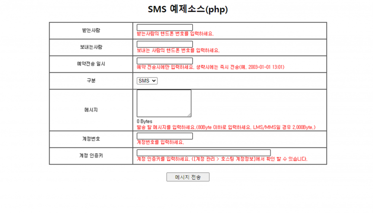
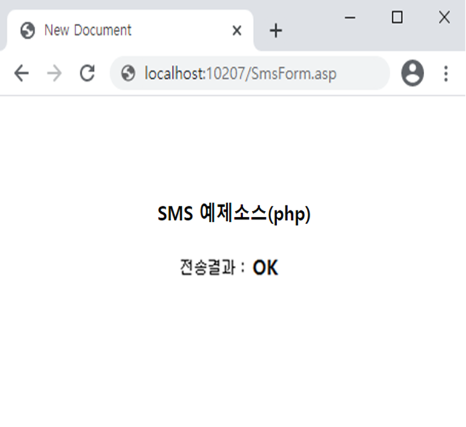
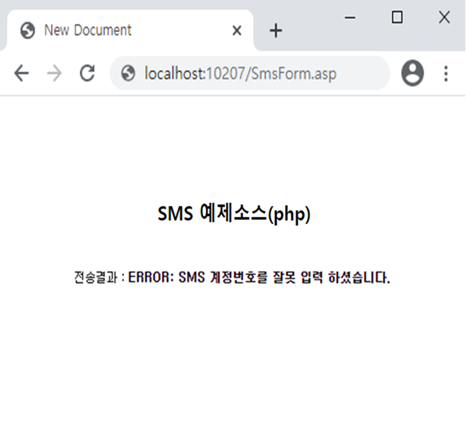

# PHP를 이용한 예제

## PHP를 이용한 SMS 웹 서비스 이용방법 <a id="asp-net-vb-sms"></a>



### 1. SMS발송 정보를 입력 받을 폼을 작성합니다. \(예제소스에 포함\) <a id="1-visual-studio-net"></a>

> 계정 인증키는 \[계정관리 &gt; 호스팅 계정정보\]에서 확인 하실 수 있습니다.​



### 2. 편집기를 이용해 아래의 소스코드를 작성하여 SendSms.asp로 저장합니다. <a id="2"></a>

> PHP로 DpSms 웹 서비스를 이용하여 메시지를 보내기 위해서는 **\*\*\[**Snoopy.php\*\*\]\([https://sourceforge.net/projects/snoopy/](https://sourceforge.net/projects/snoopy/)\) 파일을 참조해야만 합니다.

```php
<?php
include “Snoopy.class.php”;
$snoopy = new Snoopy;

/*======================================================================*\
// euc-kr 인코딩을 사용할 경우
// POST 방식
\*======================================================================*/
$cmd = “SendSms”;
$tran_phone = urlencode(iconv(‘EUC-KR’, ‘UTF-8’, $_POST[“tran_phone”]));//받는사람 핸드폰 번호
$tran_callback=urlencode(iconv(‘EUC-KR’,’UTF-8′,$_POST[“tran_callback”]));//보내는사람 핸드폰 번호
$tran_date=urlencode(iconv(‘EUC-KR’,’UTF-8′,$_POST[“tran_date”]));//예약전송 일시(생략시 즉시전송)
$tran_msg = urlencode(iconv(‘EUC-KR’,’UTF-8′,$_POST[“tran_msg”]));//전송 메시지
$guest_no = urlencode(iconv(‘EUC-KR’,’UTF-8′,$_POST[“guest_no”]));//계정번호
$guest_key = urlencode(iconv(‘EUC-KR’,’UTF-8′,$_POST[“guest_key”]));//계정 인증키
$type = urlencode(iconv(‘EUC-KR’,’UTF-8′,$_POST[“com_type”]));//발송구분
$subject = urlencode(iconv(‘EUC-KR’,’UTF-8′,$_POST[“subject”]));//LMS / MMS 발송시 제목
/*======================================================================*\
// MMS일 경우 첨부파일 처리
// 서버&로컬 에 저장된 이미지 파일 읽어올때.
// 웹경로 ,로컬경로 모두 가능 합니다.
\*======================================================================*/
//1. 웹경로
//$img_source = ‘http://websvc.nesolution.com/sms/MMSAttachFiles/M050085/20180510145947.jpg’;
//2. 로컬경로
$img_source = ‘./img/test.jpg’;

$img = file_get_contents($img_source);
$Base64files = base64_encode($img);

//”,” 콤마로 구분 최대 3개.가능합니다.
$files = $Base64files .”,”.$Base64files .”,”.$Base64files ;

/*======================================================================*\
// MMS일 경우 첨부파일 처리
// 프론트에서 이미지 파일을 base64로 생성후 post로 받아 올때.
// POST 방식
\*======================================================================*/
/*
$files = $_POST[“Base64files”];//MMS 발송시 첨부파일
*/

/*======================================================================*\
// utf-8 인코딩을 사용할 경우
// POST 방식
\*======================================================================*/
/*
$cmd = “SendSms”;
$tran_phone = urlencode($_POST[“tran_phone”]); //받는사람 핸드폰 번호
$tran_callback = urlencode($_POST[“tran_callback”]); //보내는사람 핸드폰 번호
$tran_date = urlencode($_POST[“tran_date”]); //예약전송 일시(생략시 즉시전송)
$tran_msg = urlencode($_POST[“tran_msg”]); //전송 메시지
$guest_no = urlencode($_POST[“guest_no”]); //계정번호
$guest_key = urlencode($_POST[“guest_key”]); //계정 인증키
$type = urlencode($_POST[“com_type”]); //발송구분
$subject = urlencode($_POST[“subject”]); //LMS / MMS 발송시 제목
$files = $_POST[“Base64files”];//MMS 발송시 첨부파일
*/

if($type != “MMS”)
{
/*======================================================================*\
// GET 으로 호출
이미지 첨부시 에러 발생함니다. post 로 전송하세요.
\*======================================================================*/
$method = “GET”;
$url = “http://websvc.nesolution.com/SMS/SMS.aspx?cmd=$cmd&method=$method&”;
$url = $url . “guest_no=$guest_no&guest_key=$guest_key&tran_phone=$tran_phone&”;
$url = $url . “tran_callback=$tran_callback&tran_date=$tran_date&tran_msg=$tran_msg&”;
$url = $url . “type=$type&subject=$subject”; // LMS 또는 MMS 일경우 제목 필수

$snoopy->fetchtext($url);
// 출력 페이지가 euc-kr 일때
$send_result = $snoopy->results;
// 출력 페이지가 utf-8 일때
//$send_result = iconv(‘EUC-KR’, ‘UTF-8’, $snoopy->results);
}
else
{
/*======================================================================*\
// $snoopy 사용 POST 발송(MMS 파일첨부시)
\*======================================================================*/

$formvars[“cmd”] =$cmd;
$formvars[“guest_no”] = $guest_no;
$formvars[“guest_key”] = $guest_key;
$formvars[“tran_phone”] = $tran_phone;
$formvars[“tran_callback”] = $tran_callback;
$formvars[“tran_date”] = $tran_date;
$formvars[“tran_msg”] = $tran_msg;
$formvars[“type”] = $type;
$formvars[“subject”] = $subject;
$formvars[“files”] = $files;

$snoopy->httpmethod = “POST”;
$snoopy->submit(“http://websvc.nesolution.com/SMS/SMS.aspx”,$formvars );

//출력 페이지가 euc-kr 일때
$send_result = $snoopy->results;
// 출력 페이지가 utf-8 일때
//$send_result = iconv(‘EUC-KR’, ‘UTF-8’, $snoopy->results);
?>

<HTML>
<HEAD>
<TITLE>SMS 전송 결과</TITLE>
<meta http-equiv=”Content-Type” content=”text/html; charset=ks_c_5601-1987″>
<style type=”text/css”>
<!–
.unnamed1 { font-family:”굴림”; font-size:9pt; line-height:12pt}
//–>
</style>
</HEAD>
<BODY>
<div align=”center”>
<h2>SMS 예제소스(php)</h2>
<br>
<span class=”unnamed1″>전송결과 : <b><? echo($send_result); ?></b></span>
</div>
</BODY>
</HTML>
```

> ### **파라미터** ✔ <a id="undefined"></a>

<table>
  <thead>
    <tr>
      <th style="text-align:left"><b>&#xD30C;&#xB77C;&#xBBF8;&#xD130;</b>
      </th>
      <th style="text-align:left"><b>&#xC124;&#xBA85;</b>
      </th>
    </tr>
  </thead>
  <tbody>
    <tr>
      <td style="text-align:left">cmd</td>
      <td style="text-align:left">&#xBA85;</td>
    </tr>
    <tr>
      <td style="text-align:left">tran_phone</td>
      <td style="text-align:left">
        <p>&#xC218;&#xC2E0;&#xC790; &#xC804;&#xD654;&#xBC88;&#xD638;(&#xC0DD;&#xB7B5;&#xBD88;&#xAC00;),
          &#xC5EC;&#xB7EC;&#xBC88;&#xD638;&#xC77C; &#xACBD;&#xC6B0;&#xC5D0;&#xB294;
          ;&#xC73C;&#xB85C; &#xAD6C;&#xBD84;.</p>
        <p>&#xC804;&#xD654;&#xBC88;&#xD638; &#xAD6C;&#xBD84;&#xC790; &#xB300;&#xC26C;(-)&#xB294;
          &#xC788;&#xAC70;&#xB098; &#xC5C6;&#xAC70;&#xB098; &#xC0C1;&#xAD00;&#xC5C6;&#xC74C;</p>
      </td>
    </tr>
    <tr>
      <td style="text-align:left">tran_callback</td>
      <td style="text-align:left">&#xC1A1;&#xC2E0;&#xC790; &#xC804;&#xD654;&#xBC88;&#xD638;(&#xC0DD;&#xB7B5;&#xBD88;&#xAC00;)</td>
    </tr>
    <tr>
      <td style="text-align:left">tran_date</td>
      <td style="text-align:left">
        <p>&#xC608;&#xC57D; &#xC804;&#xC1A1;&#xC2DC;&#xC5D0;&#xB9CC; &#xC0AC;&#xC6A9;,
          &#xD3EC;&#xB9F7;&#xC740; &#xC2DC;&#xBD84;&#xAE4C;&#xC9C0; &#xD3EC;&#xD568;&#xB41C;
          &#xB0A0;&#xC9DC; &#xD3EC;&#xB9F7;.</p>
        <p>&#xC0DD;&#xB7B5;&#xC2DC;&#xC5D0;&#xB294; &#xC989;&#xC2DC; &#xC804;&#xC1A1;(&#xC608;.2003-01-01
          13:01)</p>
      </td>
    </tr>
    <tr>
      <td style="text-align:left">tran_msg</td>
      <td style="text-align:left">
        <p>&#xC804;&#xC1A1; &#xBA54;&#xC2DC;&#xC9C0;(&#xC0DD;&#xB7B5;&#xBD88;&#xAC00;).</p>
        <p>SMS : &#xCD5C;&#xB300; 80byte (&#xC6A9;&#xB7C9;&#xC774; &#xB118;&#xC73C;&#xBA74;
          &#xC9E4;&#xB824;&#xC11C; &#xC804;&#xC1A1;)</p>
        <p>LMS/MMS : &#xCD5C;&#xB300; 2,000byte</p>
      </td>
    </tr>
    <tr>
      <td style="text-align:left">guest_no</td>
      <td style="text-align:left">&#xACC4;&#xC815;&#xBC88;&#xD638;(&#xC608;.000001)</td>
    </tr>
    <tr>
      <td style="text-align:left">guest_key</td>
      <td style="text-align:left">
        <p>&#xAD00;&#xB9AC;&#xC790; &#xACC4;&#xC815;&#xACFC; &#xC554;&#xD638;&#xB97C;
          &#xC774;&#xC6A9;&#xD574; &#xC0DD;&#xC131;&#xD55C; &#xACC4;&#xC815; &#xC778;&#xC99D;
          &#xD0A4;</p>
        <p>(&#xD68C;&#xC6D0;&#xC804;&#xC6A9; &#xC0AC;&#xC774;&#xD2B8;&#xC5D0;&#xC11C;
          &#xD655;&#xC778; &#xAC00;&#xB2A5;)</p>
      </td>
    </tr>
    <tr>
      <td style="text-align:left">type</td>
      <td style="text-align:left">
        <p>&#xBA54;&#xC2DC;&#xC9C0; &#xC804;&#xC1A1; &#xD0C0;&#xC785;. &quot;SMS&quot;
          / &quot;LMS&quot; / &quot;MMS&quot; / &quot;AUTO&quot; &#xC911;&#xC5D0;&#xC11C;
          &#xC120;&#xD0DD;.</p>
        <p>LMS/MMS &#xC0AC;&#xC6A9; &#xC2DC; &#xC11C;&#xBE44;&#xC2A4; &#xC2E0;&#xCCAD;&#xC774;
          &#xB418;&#xC5B4; &#xC788;&#xC5B4;&#xC57C; &#xD568;</p>
        <p>&#xBE48; &#xAC12;&#xC744; &#xB118;&#xAE30;&#xBA74; &quot;SMS&quot;&#xD615;&#xC2DD;&#xC73C;&#xB85C;
          &#xBC1C;&#xC1A1;</p>
        <p>&quot;AUTO&quot;&#xB294; &#xBA54;&#xC2DC;&#xC9C0;&#xC758; &#xAE38;&#xC774;&#xB97C;
          &#xCCB4;&#xD06C;&#xD558;&#xC5EC; 80byte&#xB97C; &#xCD08;&#xACFC; &#xC2DC;
          &#xC790;&#xB3D9;&#xC73C;&#xB85C; LMS&#xB85C; &#xBC1C;&#xC1A1;</p>
      </td>
    </tr>
    <tr>
      <td style="text-align:left">subject</td>
      <td style="text-align:left">
        <p>LMS/MMS &#xBA54;&#xC2DC;&#xC9C0;&#xC758; &#xBA54;&#xC2DC;&#xC9C0; &#xC81C;&#xBAA9;.</p>
        <p>LMS/MMS &#xBC29;&#xC2DD;&#xC744; &#xC0AC;&#xC6A9;&#xD558;&#xB294; &#xACBD;&#xC6B0;
          &#xD544;&#xC218;.</p>
      </td>
    </tr>
    <tr>
      <td style="text-align:left">files</td>
      <td style="text-align:left">
        <p>MMS &#xCCA8;&#xBD80; &#xC774;&#xBBF8;&#xC9C0; &#xD30C;&#xC77C;&#xBA85;.</p>
        <p>&#xCCA8;&#xBD80; &#xD30C;&#xC77C;&#xC774; 2&#xAC1C; &#xC774;&#xC0C1;&#xC778;
          &#xACBD;&#xC6B0; &#xCEF4;&#xB9C8;(,)&#xB85C; &#xAD6C;&#xBD84;</p>
        <p>MMS&#xC758; &#xACBD;&#xC6B0; &#xD544;&#xC218;</p>
        <p>&#xCD5C;&#xB300; 3&#xAC1C; &#xAE4C;&#xC9C0; &#xC9C0;&#xC815; &#xAC00;&#xB2A5;,
          &#xCD5C;&#xB300; 50kb gif,png,jpg &#xD30C;&#xC77C;&#xD615;&#xC2DD;</p>
      </td>
    </tr>
  </tbody>
</table>

> ### **반환 값** ✔ <a id="undefined-1"></a>


#### 성공 시    "OK"



**실패 시 "Exception: 에러메시지"**


### 3. 실행결과 화면입니다.

> 정상적으로 메시지가 발송되었을 경우



> 오류로 인하여 메시지를 발송하지 못했을 경우



